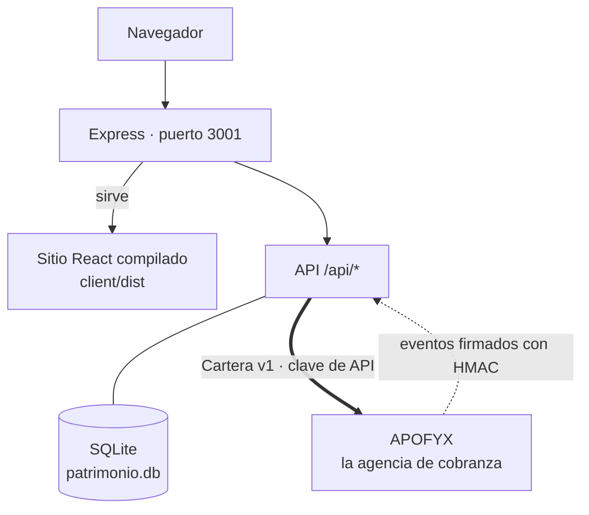
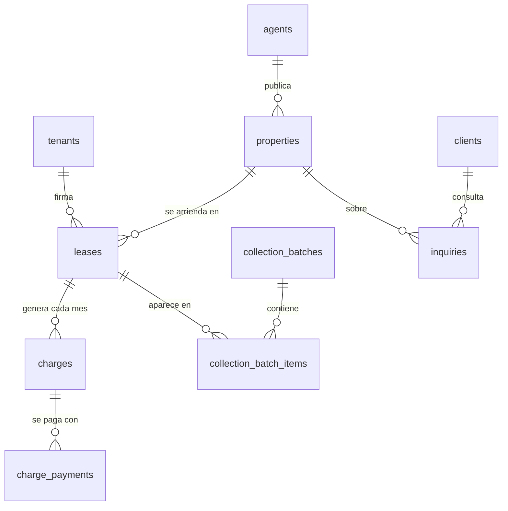

# Patrimonio Inmuebles

[](https://github.com/TechnicalBridge/patrimonioinmuebles/actions/workflows/ci.yml)

Sitio y panel de una corredora de propiedades chilena. Proyecto de Capstone; la empresa, las
personas y las propiedades son ficticias.

**Se levanta con una orden** y queda en http://localhost:3001 — solo hace falta Docker:

```powershell
docker compose up -d --build
```

| | |
| --- | --- |
| [1. Descripción](#1-descripción) | [2. Tecnologías](#2-tecnologías-utilizadas) · [3. Cómo ejecutarlo](#3-cómo-ejecutar-el-proyecto-localmente) · [4. Equipo](#4-integrantes-del-equipo) |
| [5. Metodología](#5-metodología-de-trabajo) | [6. Arquitectura](#6-arquitectura-de-la-solución) · [7. Modelo de datos](#7-modelo-de-datos) · [8. Docker](#8-docker) · [9. Pruebas](#9-pruebas) |

---

## 1. Descripción

### Qué hace

Patrimonio Inmuebles vende, arrienda y **administra arriendos**: cobra el arriendo mes a mes por
cuenta del propietario. El sitio publica las propiedades y recibe consultas; el panel interno
maneja clientes, asesores, inventario y —la parte que importa para este proyecto— la
administración de arriendos.

Esa administración es lo que convierte a la corredora en **acreedora**: cuando un arrendatario
deja de pagar, esa deuda es suya. Desde el panel se generan los cargos del mes, se registran los
pagos recibidos en la oficina y se emite la **cartera morosa** a una fecha de corte, que se
entrega a una agencia de cobranza.

### A quién va dirigido

| Quién | Qué hace acá |
| --- | --- |
| **Quien busca propiedad** | Mira el catálogo y deja su consulta |
| **El personal de la corredora** | Usa el panel: clientes, consultas, propiedades y arriendos |
| **El arrendatario moroso** | No entra acá. Su deuda sale hacia la cobranza, y paga en otro sistema |

### Qué problema resuelve

Una corredora que administra arriendos tiene el mismo problema que cualquier acreedor chico: las
deudas son de monto bajo, son muchas, y perseguirlas una por una cuesta más de lo que recupera.
Además, si terceriza la cobranza, **se queda sin saber qué pasó**: le siguen cobrando a quien ya
pagó, y eso le cuesta el arrendatario.

Este sistema resuelve las dos puntas. Genera la cartera morosa en un formato acordado para que
una agencia la reciba sin que nadie transcriba nada, y **recibe de vuelta los avisos de pago**,
firmados, para que el contrato quede en $0 sin intervención humana. Un contrato que se puso al
día después de haber sido entregado sale en la cartera siguiente como **retiro**, no como deuda.

---

## 2. Tecnologías utilizadas

| Capa | Tecnología | Por qué |
| --- | --- | --- |
| **Lenguaje** | JavaScript (ES modules), Node 22 | |
| **Backend** | Express 4 | Una API pequeña: no necesita más |
| **Frontend** | React 18 · React Router 7 · Vite | |
| **Base de datos** | **SQLite**, con `sql.js` | Ver abajo |
| **Pruebas** | `node:test`, de la librería estándar | Sin dependencias de prueba que mantener |
| **Contenedores** | Docker · Docker Compose | |
| **Integración continua** | GitHub Actions | Pruebas y compilación del cliente en cada push |

**Por qué SQLite y no MySQL,** si los otros dos sistemas usan MySQL: porque esta empresa es
chica y su base cabe en un archivo. Un motor aparte agregaría un contenedor, un usuario, una
contraseña y un punto de falla, a cambio de nada que este sistema necesite. Es además la
demostración de que la integración funciona **entre motores distintos**: lo que une a los tres
sistemas es un contrato en HTTP, no una base compartida.

**Nube:** ninguna.

---

## 3. Cómo ejecutar el proyecto localmente

### La forma corta: todo en Docker

Lo único que hace falta es **Docker Desktop** corriendo.

```powershell
git clone https://github.com/TechnicalBridge/patrimonioinmuebles.git
cd patrimonioinmuebles
docker compose up -d --build
```

| | |
| --- | --- |
| Sitio | http://localhost:3001 |
| Panel | http://localhost:3001/admin · clave `patrimonio` |

La base se crea sola la primera vez, con propiedades, clientes y contratos de demostración, y
vive en un volumen: sobrevive a `docker compose down` y a reconstruir la imagen. Los
[arriendos de demostración](#los-arriendos-de-demostración) se revisan en cada arranque: si falta
alguno, se agrega sin tocar lo que ya había. Para partir de cero, `docker compose down -v`.

### Para programar

Hace falta **Node 22 o superior**.

```powershell
npm install
npm run install:all
npm run dev
```

| | |
| --- | --- |
| Sitio | http://localhost:5173 |
| API | http://localhost:3001 |

Vite recarga al guardar y manda `/api` al servidor. La base queda en `server/patrimonio.db`.

> **Ojo con el esquema.** Las tablas se crean con `CREATE TABLE IF NOT EXISTS`, así que **un
> cambio de columnas no se aplica sobre una base existente**: hay que borrar
> `server/patrimonio.db` y dejar que el servidor la regenere con los datos de demostración.

---

## 4. Integrantes del equipo

> **⚠ POR COMPLETAR ANTES DE ENTREGAR.** El equipo tiene que llenar la columna de rol.

| Integrante | Rol |
| --- | --- |
| Pedro Campos | |
| Martín Gutiérrez | |
| Flavio Henríquez | |
| Esteban Maino | |

---

## 5. Metodología de trabajo

**Kanban**, con prácticas de **DevOps** para la entrega. El seguimiento tarea por tarea de los
tres sistemas está en
[`TB_web/docs/plan-kanban.md`](https://github.com/TechnicalBridge/TB_web/blob/main/docs/plan-kanban.md).

En este repositorio eso se traduce en dos cosas concretas:

| Práctica | Qué resuelve |
| --- | --- |
| **Integración continua** | GitHub Actions corre las 14 pruebas y compila el cliente en cada push |
| **Pruebas sobre base temporal** | Corren con `PATRIMONIO_DB` apuntando a un archivo temporal, así que **nunca tocan los datos de desarrollo**. Una de ellas compara la cartera que genera el panel contra el ejemplo publicado del contrato: si alguno de los dos cambia, la prueba falla |

---

## 6. Arquitectura de la solución

Un solo proceso: Express sirve la API y, si encuentra el sitio compilado, también el sitio. El
cliente llama a `/api` con rutas relativas, así que no hay CORS que resolver ni un segundo
servidor que mantener.



| Módulo | Qué hace |
| --- | --- |
| `server/index.js` | Las rutas: sitio público, panel, API de arriendos y el endpoint de eventos |
| `server/db.js` | La base: esquema, siembra y el acceso |
| `server/arriendos.js` | La lógica del negocio: cargos del mes, pagos, morosos al corte |
| `server/cartera.js` | Genera la cartera morosa en el formato del contrato |
| `client/` | El sitio y el panel en React |

### La cartera morosa

`server/cartera.js` la arma en el formato **Cartera v1** del
[contrato de integración](https://github.com/TechnicalBridge/TB_web/tree/main/docs/integracion),
y funciona igual con agencia de cobranza, contra la plataforma de pagos directo, o sin nadie: el
módulo devuelve el objeto y quien lo envía decide después.

En el panel, la pestaña **arriendos** muestra los morosos a la fecha que elijas, con su deuda y
sus días de mora, y permite:

- **Generar los cargos del mes.** Correrlo dos veces no cobra dos veces.
- **Registrar un pago** recibido en la oficina, total o parcial.
- **Emitir la cartera** a una fecha de corte. Queda en borrador y se puede descargar como
  archivo; recién al marcarla como enviada cuenta como entregada.

### Los arriendos de demostración

Diez contratos, cada uno en una situación distinta. Son los mismos arrendatarios que traen los
datos de ejemplo de APOFYX y de DataBridge, así que los tres sistemas cuentan la misma historia.

| Contrato | Arrendatario | Situación |
| --- | --- | --- |
| CTR-2025-014 | Felipe Rojas Muñoz | Debe agosto y septiembre |
| CTR-2026-031 | Valentina Soto Pizarro | Debe septiembre |
| CTR-2024-007 | Comercial Ñandú SpA | Debe julio a septiembre, en UF |
| CTR-2025-022 | Tomás Fuentes Leiva | Se puso al día en la oficina: en la cartera de septiembre va como retiro |
| CTR-2026-008 | Josefa Alcaíno Ruiz | Al día |
| CTR-2025-019 | Rodrigo Pérez Contreras | Debe junio a septiembre |
| CTR-2026-012 | Carolina Muñoz Vera | Debe agosto y septiembre |
| CTR-2024-019 | Panadería La Espiga Ltda. | Debe julio a septiembre, en UF |
| CTR-2025-027 | Ignacio Tapia Rojas | Entregó el departamento el 31 de agosto debiendo junio a agosto. Su contrato terminó, y ya no va en la cartera |
| CTR-2026-015 | Daniela Cáceres Flores | Debe julio a septiembre |

La cartera de agosto (`PAT-2026-08-18-01`) figura como entregada, con ocho deudas.

### Recibir los pagos desde la cobranza

`POST /api/eventos` recibe los avisos de pago y marca los cargos. Pide firma HMAC y **está
apagado mientras no definas `EVENTOS_SECRET`**:

```powershell
$env:EVENTOS_SECRET = "una-clave-larga"
npm run dev
```

El secreto lo entrega APOFYX al registrar la URL de Patrimonio
(`python manage.py suscribir_cliente 76418902-7 http://localhost:3001/api/eventos`). Con eso, un
pago hecho en el portal de DataBridge termina como abono en el contrato, repartido del cargo más
antiguo al más nuevo.

No hay secreto por omisión **a propósito**: uno escrito en el código no es un secreto. Sin
configurarlo, Patrimonio funciona igual y los pagos se registran a mano.

---

## 7. Modelo de datos



| Tabla | Qué guarda |
| --- | --- |
| `properties` | Título, tipo, operación, precio y moneda, dormitorios, baños, m², dirección, comuna, región y fotos |
| `clients` · `inquiries` · `agents` | Quién pregunta, por qué propiedad, y qué asesor la atiende |
| `tenants` | El arrendatario, con su **RUT** normalizado. Va aparte de `clients` porque un cliente pregunta por una propiedad y un arrendatario firmó y debe plata |
| `leases` | El contrato. Su `codigo` (`CTR-2025-014`) es el identificador que viaja a la cobranza y permite que un pago vuelva hasta acá |
| `charges` | Un cargo por mes. El `UNIQUE` impide cobrar dos veces el mismo período |
| `charge_payments` | Los pagos, sumados aparte. **El saldo se calcula, no se guarda**, para que no haya dos números que puedan discrepar |
| `collection_batches` | Qué cartera se entregó a cobranza y cuándo |
| `inbound_events` | Los avisos recibidos, para no procesar dos veces el mismo |

Dos vistas hacen las cuentas: `v_charge_balance` (saldo de cada cargo) y `v_lease_debt` (deuda
por contrato). Las propiedades en administración quedan con estatus `arrendada`, así que no se
publican en el sitio.

La venta se publica en **UF** y el arriendo residencial en **pesos**; el arriendo comercial se
pacta en UF. Por eso cada propiedad guarda su moneda.

> **Ojo con las llaves foráneas.** `db.export()` de sql.js cierra y reabre la base, lo que apaga
> el PRAGMA `foreign_keys`. Como acá se persiste después de cada escritura, hay que volver a
> encenderlo pegado al `export`; si no, las llaves foráneas quedan decorativas desde el primer
> INSERT.

---

## 8. Docker

### Qué se construye

Una sola imagen, [`Dockerfile`](Dockerfile), en **dos etapas**: la primera compila el sitio con
Node, la segunda instala solo las dependencias de producción del servidor y copia el sitio
compilado al lado. La imagen final no lleva las herramientas de compilación.

El contenedor **no corre como root** (usuario `node`, el que trae la imagen oficial) y declara un
`healthcheck` contra `/api/health`.

La base vive en un **volumen** (`/datos/patrimonio.db`), no dentro de la imagen: si estuviera
dentro, cada reconstrucción borraría los datos.

### Variables de entorno

Documentadas en [`.env.example`](.env.example). Todas tienen valor por omisión.

| Variable | Por omisión | Para qué |
| --- | --- | --- |
| `PORT` | `3001` | Puerto del sitio y de la API |
| `ADMIN_PASSWORD` | `patrimonio` | Clave del panel. **Cambiar** |
| `PATRIMONIO_DB` | `/datos/patrimonio.db` en el contenedor | Dónde vive la base |
| `EVENTOS_SECRET` | vacía | Firma de los avisos de pago. **Sin ella el endpoint está apagado** |
| `COBRANZA_URL`, `COBRANZA_CLAVE`, `COBRANZA_AGENCIA_RUT` | vacías | Entregarle la cartera a la agencia. Sin ellas se descarga a mano |

---

## 9. Pruebas

```powershell
npm test
```

**14 pruebas** con `node:test`, sobre una base temporal, así que no tocan `server/patrimonio.db`.

| Qué cubre |
| --- |
| El cálculo de morosos a una fecha de corte, con sus días de mora |
| Que emitir los cargos del mes dos veces no cobre dos veces |
| Que un pago en la oficina deje el **saldo** en la cartera, no el monto original, y que el mismo pago no abone dos veces |
| Que el lote se emita, se descargue y se marque enviado una sola vez |
| Los eventos de pago: firma, antirrepetición y deduplicación |
| Que la cartera generada sea **exactamente** el ejemplo publicado del contrato de integración, y que la copia local siga al día con la de `TB_web` si ese repositorio está al lado |
| Que dos propiedades con el mismo título no revienten: la segunda recibe otro slug |
| Que **ningún error salga con la traza del servidor** |
| Que las llaves foráneas sigan encendidas después de persistir, y que la base rechace lo que el negocio no permite |

---

Este repositorio es una de tres piezas: **Patrimonio Inmuebles** →
[**APOFYX**](https://github.com/TechnicalBridge/APOFYX) →
[**DataBridge**](https://github.com/TechnicalBridge/TB_web).
