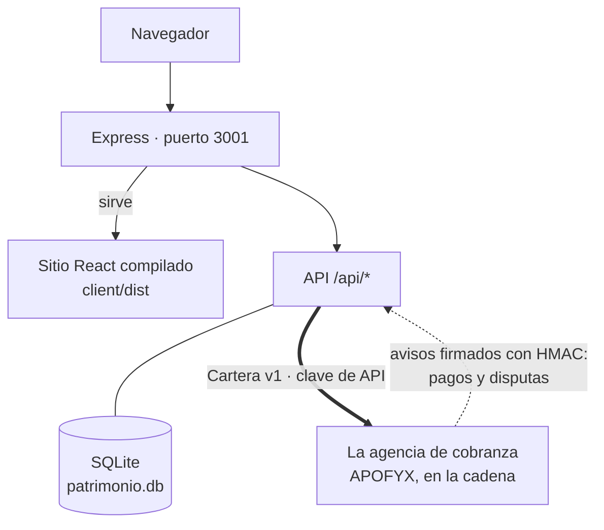
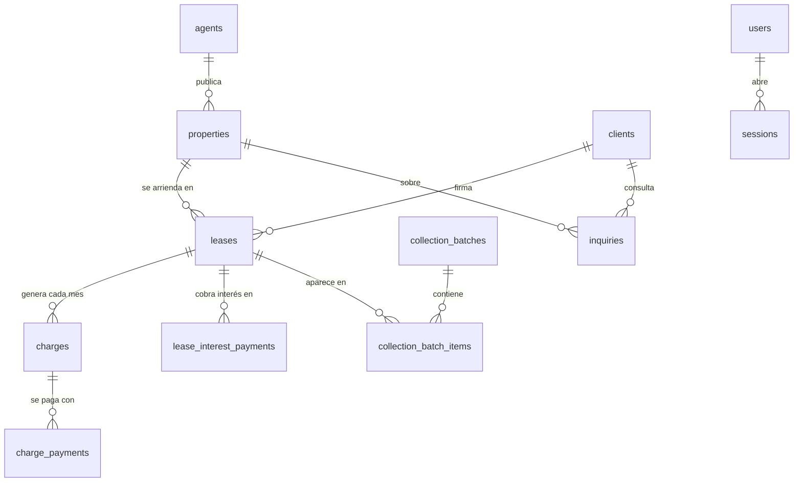

# Patrimonio Inmuebles

[](https://github.com/TechnicalBridge/patrimonioinmuebles/actions/workflows/ci.yml)

Sitio y panel de una corredora de propiedades chilena que **administra arriendos**. Proyecto de
Capstone; la empresa, las personas y las propiedades son ficticias.

**Contexto.** Kobra fue el cliente directo original del equipo y se retiró. El equipo creó
APOFYX, una agencia de cobranza ficticia, para continuar el Capstone. Patrimonio Inmuebles es el
**acreedor** de la cadena: entrega su cartera a la agencia y recibe de vuelta lo que pasó con cada
deuda. **Patrimonio Inmuebles** → [APOFYX](https://github.com/TechnicalBridge/APOFYX), la agencia →
[DataBridge](https://github.com/TechnicalBridge/TB_web), donde el arrendatario paga.

**Se levanta con dos órdenes** y queda en http://localhost:3001. Solo hace falta Docker:

```powershell
powershell -ExecutionPolicy Bypass -File .\preparar-env.ps1    # una sola vez: el .env con claves al azar
docker compose up -d --build
```

| | |
| --- | --- |
| [1. Descripción](#1-descripción) | [2. Tecnologías](#2-tecnologías-utilizadas) · [3. Cómo ejecutarlo](#3-cómo-ejecutar-el-proyecto-localmente) · [4. Equipo](#4-integrantes-del-equipo) |
| [5. Metodología](#5-metodología-de-trabajo) | [6. Arquitectura](#6-arquitectura-de-la-solución) · [7. Modelo de datos](#7-modelo-de-datos) · [8. Docker](#8-docker) |
| [9. Pruebas](#9-pruebas) | [Estado al 3 de octubre de 2026](#estado-al-3-de-octubre-de-2026) |

---

## 1. Descripción

### Qué hace

Patrimonio Inmuebles vende, arrienda y **administra arriendos**: cobra el arriendo mes a mes por
cuenta del propietario. El sitio publica las propiedades y recibe consultas; el panel interno maneja
clientes, inventario y la administración de arriendos.

Esa administración es lo que convierte a la corredora en **acreedora**: cuando un arrendatario deja
de pagar, esa deuda es suya. Desde el panel:

- se firman los contratos y se generan los cargos del mes;
- se registran los pagos recibidos en la oficina;
- se emite la **cartera** a una fecha de corte, con todos los clientes con contrato, deban o no, y
  se le entrega a la agencia de cobranza conectada, que detecta a los morosos.

De vuelta, la agencia le avisa a Patrimonio lo que pasó: un pago deja el contrato al día, y un
reclamo del arrendatario aparece en el contrato como **en disputa** hasta que se resuelve.

### A quién va dirigido

| Quién | Qué hace acá |
| --- | --- |
| **Quien busca propiedad** | Mira el catálogo y deja su consulta |
| **El personal de la corredora** | Entra al panel con su usuario: clientes, contratos, propiedades, arriendos y la conexión con la cobranza |
| **El arrendatario moroso** | No entra acá. Su deuda sale hacia la cobranza, y paga o reclama en otro sistema |

### Qué problema resuelve

Una corredora que administra arriendos tiene el mismo problema que cualquier acreedor chico: las
deudas son de monto bajo, son muchas, y perseguirlas una por una cuesta más de lo que recupera.
Además, si terceriza la cobranza, **se queda sin saber qué pasó**: le siguen cobrando a quien ya
pagó, y eso le cuesta el arrendatario.

Este sistema resuelve las dos puntas:

- genera la cartera en un formato acordado, para que la agencia la reciba sin que nadie transcriba
  nada;
- **recibe de vuelta los avisos**, firmados: un pago deja el contrato en $0 sin intervención humana,
  y un reclamo queda a la vista mientras se revisa.

Como cada mes van todos los clientes con contrato, el que se puso al día va **sin cargos**, y la
agencia deja de cobrarle.

---

## 2. Tecnologías utilizadas

| Capa | Tecnología | Por qué |
| --- | --- | --- |
| **Lenguaje** | JavaScript (ES modules), Node 22 | |
| **Backend** | Express 4 | Una API pequeña: no necesita más |
| **Frontend** | React 18 · React Router 7 · Vite | |
| **Base de datos** | **SQLite**, con `sql.js` | Ver abajo |
| **Seguridad** | `node:crypto`: scrypt para las claves, AES-256-GCM para los secretos | Sin dependencias externas |
| **Pruebas** | `node:test`, de la librería estándar | Sin dependencias de prueba que mantener |
| **Contenedores** | Docker · Docker Compose | |
| **Integración continua** | GitHub Actions | Pruebas y compilación del cliente en cada push |

**Por qué SQLite y no MySQL,** si los otros dos sistemas usan MySQL: esta empresa es chica y su
base cabe en un archivo. Un motor aparte agregaría un contenedor, un usuario, una contraseña y un
punto de falla, a cambio de nada que este sistema necesite. Además demuestra que la integración
funciona **entre motores distintos**: lo que une a los tres sistemas es un contrato en HTTP, no una
base compartida.

**Nube:** ninguna.

---

## 3. Cómo ejecutar el proyecto localmente

### La forma corta: todo en Docker

Lo único que hace falta es **Docker Desktop** corriendo.

La primera vez, `preparar-env.ps1` crea el `.env` con la clave del panel y la llave de cifrado al
azar: **ninguna tiene un valor escrito en el repositorio**, porque sería público. Sin el `.env`,
`docker compose` se detiene y dice cuál falta.

```powershell
git clone https://github.com/TechnicalBridge/patrimonioinmuebles.git
cd patrimonioinmuebles
powershell -ExecutionPolicy Bypass -File .\preparar-env.ps1    # una sola vez: el .env con claves al azar
docker compose up -d --build
```

| | |
| --- | --- |
| Sitio | http://localhost:3001 |
| Panel | http://localhost:3001/admin · `admin@patrimonioinmuebles.cl`, con la clave de `ADMIN_PASSWORD` de tu `.env` |

La base se crea sola la primera vez, con propiedades, clientes y contratos de demostración, y vive
en un volumen: sobrevive a `docker compose down` y a reconstruir la imagen. Para partir de cero,
`docker compose down -v`.

### Para programar

Hace falta **Node 22 o superior**. El servidor lee los secretos del mismo `.env` de la raíz.

```powershell
powershell -ExecutionPolicy Bypass -File .\preparar-env.ps1    # si todavía no tienes .env
npm install
npm run install:all
npm run dev
```

| | |
| --- | --- |
| Sitio | http://localhost:5173 |
| API | http://localhost:3001 |

Vite recarga al guardar y manda `/api` al servidor. La base queda en `server/patrimonio.db`.

> **Evolución del esquema.** La base lleva su versión en `PRAGMA user_version`, y `server/db.js`
> tiene la lista de migraciones. Al arrancar, una base anterior se pone al día sola y conserva sus
> datos, dentro de una transacción: si algo falla, no queda nada a medias. Aun así, **respalda la
> base antes** (`patrimonio.db`, o el volumen `patrimonio_datos`).
>
> | Versión | Qué trae |
> | --- | --- |
> | 1 | El esquema original |
> | 2 | Un solo registro de cliente (se funde `tenants` en `clients`), usuarios, sesiones y la conexión con la agencia |
> | 3 | La disputa en el contrato, el límite de intentos del login en la base y los secretos de la agencia cifrados |

---

## 4. Integrantes del equipo

> **⚠ POR COMPLETAR ANTES DE ENTREGAR.** El equipo tiene que llenar la columna de rol.

| Integrante | Rol |
| --- | --- |
| Pedro Campos | |
| Martín Gutiérrez | |
| Flavio Henríquez | |
| Esteban Maino | |

---

## 5. Metodología de trabajo

**Kanban**, con prácticas de **DevOps** para la entrega. El seguimiento tarea por tarea de los
tres sistemas está en
[`TB_web/docs/plan-kanban.md`](https://github.com/TechnicalBridge/TB_web/blob/main/docs/plan-kanban.md).

En este repositorio eso se traduce en dos prácticas concretas:

| Práctica | Qué resuelve |
| --- | --- |
| **Integración continua** | GitHub Actions corre las pruebas y compila el cliente en cada push |
| **Pruebas sobre base temporal** | Corren con `PATRIMONIO_DB` apuntando a un archivo temporal, así que **nunca tocan los datos de desarrollo**. Una de ellas compara la cartera que genera el panel con el ejemplo publicado del contrato: si alguno de los dos cambia, la prueba falla |

---

## 6. Arquitectura de la solución

Un solo proceso: Express sirve la API y, si encuentra el sitio compilado, también el sitio. El
cliente llama a `/api` con rutas relativas, así que no hay CORS que abrir ni un segundo servidor que
mantener.


```mermaid
flowchart TD
    N["Navegador"] --> E["Express · puerto 3001"]
    E -->|"sirve"| C["Sitio React compilado<br/>client/dist"]
    E --> A["API /api/*"]
    A --- B[("SQLite<br/>patrimonio.db")]

    A ==>|"Cartera v1 · clave de API"| AP["La agencia de cobranza<br/>APOFYX, en la cadena"]
    AP -.->|"avisos firmados con HMAC:<br/>pagos y disputas"| A
```

| Módulo | Qué hace |
| --- | --- |
| `server/index.js` | Las rutas: sitio público, panel, API de arriendos y el receptor de avisos |
| `server/db.js` | La base: esquema, migraciones versionadas, siembra y el acceso |
| `server/usuarios.js` · `server/claves.js` | El login: claves con scrypt, sesiones en la base y el límite de intentos |
| `server/cifrado.js` | Cifra y descifra los secretos de la agencia (AES-256-GCM) |
| `server/clientes.js` · `server/rut.js` | Los clientes, del interesado al arrendatario, y el RUT con su dígito verificador |
| `server/arriendos.js` | El negocio: contratos, cargos del mes, pagos, morosos al corte, lotes y los avisos que vuelven |
| `server/cartera.js` | Genera la cartera en el formato del contrato |
| `server/cobranza.js` | La conexión con la agencia: la comprueba, se suscribe a sus avisos y le envía la cartera |
| `client/` | El sitio y el panel en React |

### El panel

Se entra con **correo y clave** (`/admin`). Cada usuario tiene su clave, guardada con scrypt. La
sesión se guarda en la base (solo el hash del token), dura 8 horas y **Salir** la revoca en el
servidor. Tras cinco intentos fallidos, esa IP espera diez minutos; el conteo vive en la base, por
la huella de la IP, así que un reinicio no se lo devuelve a nadie.

| Pestaña | Qué hace |
| --- | --- |
| **Clientes** | Un solo registro por persona o empresa: el que preguntó por una propiedad es *interesado*, y al firmar pasa a *arrendatario*. Desde su ficha se firma un contrato |
| **Arriendos** | Los morosos a la fecha que elijas, los contratos, los cargos del mes, los pagos en la oficina y las carteras entregadas |
| **Cobranza** | La conexión con la agencia |

**Un contrato nuevo puede empezar en el pasado:** al firmarlo se emiten los arriendos desde el mes
de inicio hasta hoy. Un contrato que empezó hace tres meses sin pagos es un moroso real. Para
firmar, el cliente necesita RUT y un correo o teléfono, y la base lo exige con un trigger.

### La cartera

`server/cartera.js` la arma en el formato **Cartera v1** del
[contrato de integración](https://github.com/TechnicalBridge/TB_web/tree/main/docs/integracion).
Van **todos los clientes con contrato, deban o no**: el que está al día va con `cargos: []`, y un
contrato terminado sigue yendo mientras deba. Así la agencia detecta al moroso, y deja de cobrarle
al que pagó directo en la oficina.

En la pestaña **Arriendos**:

- **Generar los cargos del mes.** Correrlo dos veces no cobra dos veces.
- **Registrar un pago** recibido en la oficina, total o parcial.
- **Emitir la cartera** a una fecha de corte. Queda en borrador y se puede descargar como archivo;
  recién al enviarla cuenta como entregada.
- **Enviarla a la agencia** con el botón *Enviar a {la agencia conectada}*. El lote guarda la
  respuesta contrato por contrato: cuántas aceptó y, de las que no, el motivo. Si la agencia no
  contesta, el lote sigue en borrador y se puede volver a enviar tal cual. Sin agencia conectada,
  el botón es *Marcar enviada* y el archivo se entrega a mano.

### El interés por mora

Un contrato puede pactar un **interés por mora**, en porcentaje mensual: al firmarlo, en la ficha
del cliente, el campo *Interés por mora (% mensual, opcional)*. Lo normal es en un arriendo
comercial; uno sin interés deja el campo vacío.

Patrimonio no calcula el interés: lo manda en la cartera (`tasa_interes_mensual`) y la plataforma
de pagos lo cobra. Cada arriendo atrasado crece un poco cada día desde su vencimiento: al 2%
mensual, un arriendo de $300.000 con 31 días de atraso suma $6.200. Si el arrendatario paga el
interés, el aviso lo trae aparte del capital: los cargos bajan solo por el capital, y el interés
queda anotado en `lease_interest_payments`. En **Arriendos**, el contrato dice *2% mensual por
mora* y cuánto interés cobró la cobranza.

La tasa no puede superar el tope legal que fija la plataforma (hoy, 3% mensual): si lo supera, la
cartera vuelve con ese contrato rechazado (`tasa_sobre_maxima`).

### La conexión con la agencia

Patrimonio no tiene escrito el nombre de ninguna agencia. En la pestaña **Cobranza** se pega la
dirección de la agencia y la clave que ella emitió para Patrimonio (en APOFYX, desde su portal de
empresas, en *Conectar mi sistema*). Al tocar **Conectar**:

1. `GET {agencia}/api/v1/cuenta` comprueba que la clave sirve y que es de Patrimonio;
2. `POST {agencia}/api/v1/suscripciones` le dice a la agencia dónde avisar;
3. se guarda la conexión en `agency_connection`, con la clave y el secreto de los avisos
   **cifrados**.

El panel muestra *Conectado con APOFYX*: el nombre lo dijo la agencia. Sirve igual cualquier
agencia que hable el contrato, o la plataforma de pagos directo.

Si Patrimonio corre en Docker, la dirección de avisos viene prellenada con `host.docker.internal`,
y si la agencia no responde en `localhost` el error explica por qué: dentro de un contenedor,
`localhost` es el propio contenedor.

### Los avisos que vuelven

`POST /api/eventos` recibe los avisos de la agencia. Pide firma HMAC con el secreto que la agencia
entregó al conectarse, se descarta si tiene más de 5 minutos, y el mismo aviso dos veces se procesa
una. **Está apagado mientras no haya agencia conectada.**

| Aviso | Qué hace Patrimonio |
| --- | --- |
| `pago.confirmado` | Abona el capital a los cargos del contrato, del más antiguo al más nuevo, con medio `cobranza`. Si el pago trae interés por mora, lo anota aparte, una sola vez, sin tocar los cargos |
| `deuda.saldada` | Lo anota: el saldo ya salió de los pagos |
| `deuda.disputada` | El contrato queda **En disputa**, con el motivo que dio el arrendatario (*dice que ya pagó*, *no reconoce la deuda*…) |
| `deuda.reanudada` | **Disputa rechazada:** la deuda corresponde y se sigue cobrando |
| `deuda.retirada` por `disputa_resuelta` | **Disputa aceptada:** no correspondía, y la agencia la sacó de su cobranza |

Patrimonio no cambia ningún cargo por una disputa: muestra en qué va, y revisar el contrato le toca
a la corredora. Sin agencia, Patrimonio funciona igual y los pagos se registran a mano.

### Los arriendos de demostración

Diez contratos, cada uno en una situación distinta. Son los mismos arrendatarios que traen los
datos de ejemplo de APOFYX y de DataBridge, así que los tres sistemas cuentan la misma historia.

| Contrato | Arrendatario | Situación |
| --- | --- | --- |
| CTR-2025-014 | Felipe Rojas Muñoz | Debe agosto y septiembre |
| CTR-2026-031 | Valentina Soto Pizarro | Debe septiembre |
| CTR-2024-007 | Comercial Ñandú SpA | Debe julio a septiembre, en UF, con interés por mora de 1,5% mensual |
| CTR-2025-022 | Tomás Fuentes Leiva | Se puso al día en la oficina: en la cartera va sin cargos |
| CTR-2026-008 | Josefa Alcaíno Ruiz | Al día |
| CTR-2025-019 | Rodrigo Pérez Contreras | Debe junio a septiembre |
| CTR-2026-012 | Carolina Muñoz Vera | Debe agosto y septiembre |
| CTR-2024-019 | Panadería La Espiga Ltda. | Debe julio a septiembre, en UF |
| CTR-2025-027 | Ignacio Tapia Rojas | Entregó el departamento el 31 de agosto debiendo junio a agosto. Su contrato terminó, pero sigue en la cartera mientras deba |
| CTR-2026-015 | Daniela Cáceres Flores | Debe julio a septiembre |

La cartera de agosto (`PAT-2026-08-18-01`) figura como entregada, con ocho deudas.

---

## 7. Modelo de datos


```mermaid
erDiagram
    properties ||--o{ leases          : "se arrienda en"
    clients    ||--o{ leases          : "firma"
    leases     ||--o{ charges         : "genera cada mes"
    leases     ||--o{ lease_interest_payments : "cobra interés en"
    charges    ||--o{ charge_payments : "se paga con"
    collection_batches ||--o{ collection_batch_items : "contiene"
    leases     ||--o{ collection_batch_items : "aparece en"
    clients    ||--o{ inquiries       : "consulta"
    properties ||--o{ inquiries       : "sobre"
    agents     ||--o{ properties      : "publica"
    users      ||--o{ sessions        : "abre"
```

| Tabla | Qué guarda |
| --- | --- |
| `properties` | Título, tipo, operación, precio y moneda, dormitorios, baños, m², dirección, comuna, región y fotos |
| `clients` | El cliente, persona o empresa, con su **RUT** normalizado (único si está). El interesado y el arrendatario son el mismo registro en otra etapa. Un trigger impide firmar sin RUT o sin correo ni teléfono, y quitarle el RUT a quien ya firmó |
| `inquiries` · `agents` | Por qué propiedad preguntó el cliente, y qué asesor la atiende |
| `leases` | El contrato, de un cliente. Su `codigo` (`CTR-2025-014`) es el identificador que viaja a la cobranza y permite que un aviso vuelva hasta acá. `tasa_interes_mensual` es el interés por mora pactado, si hay. `disputa_estado` (`abierta`, `rechazada` o `aceptada`), `disputa_motivo` y `disputa_desde` dicen en qué va un reclamo |
| `charges` | Un cargo por mes. El `UNIQUE` impide cobrar dos veces el mismo período |
| `charge_payments` | Los pagos, sumados aparte. **El saldo se calcula, no se guarda**, para que no haya dos números que puedan discrepar |
| `lease_interest_payments` | El interés por mora que cobró la cobranza, por contrato. La `referencia` es única, así que un aviso repetido no lo anota dos veces |
| `collection_batches` | Qué cartera se entregó a cobranza, cuándo, y qué respondió la agencia: `enviado`, `aceptado` o `parcial` |
| `inbound_events` | Los avisos recibidos, para no procesar dos veces el mismo |
| `users` · `sessions` | Los usuarios del panel, con su clave en scrypt, y sus sesiones: el hash del token, cuándo vence y si se cerró |
| `login_intentos` | Los intentos fallidos del login por la huella de la IP (la IP no se guarda), y hasta cuándo queda bloqueada |
| `agency_connection` | Una sola fila: la agencia conectada, y su clave y el secreto de sus avisos **cifrados** |

Dos vistas hacen las cuentas: `v_charge_balance` (saldo de cada cargo) y `v_lease_debt` (deuda por
contrato). Las propiedades en administración quedan con estatus `arrendada`, así que no se publican
en el sitio.

**Secretos.** La clave de la agencia y el secreto de sus avisos hay que leerlos de vuelta —uno se
presenta en cada llamada y con el otro se verifica cada aviso—, así que no pueden guardarse como
huella. Van cifrados con **AES-256-GCM** (`server/cifrado.js`), con una llave que no está en la base
(`CIFRADO_LLAVE`): quien se lleve una copia del archivo no se lleva los secretos. La migración a la
versión 3 cifró los que ya estaban guardados.

La venta se publica en **UF** y el arriendo residencial en **pesos**; el arriendo comercial se pacta
en UF. Por eso cada propiedad guarda su moneda.

> **Ojo con las llaves foráneas.** `db.export()` de sql.js cierra y reabre la base, lo que apaga el
> PRAGMA `foreign_keys`. Como acá se persiste después de cada escritura, hay que volver a encenderlo
> pegado al `export`; si no, las llaves foráneas quedan decorativas desde el primer INSERT.

---

## 8. Docker

### Qué se construye

Una sola imagen, [`Dockerfile`](Dockerfile), en **dos etapas**: la primera compila el sitio con Node,
la segunda instala solo las dependencias de producción del servidor y copia el sitio compilado al
lado. La imagen final no lleva las herramientas de compilación.

El contenedor **no corre como root** (usuario `node`, el que trae la imagen oficial) y declara un
`healthcheck` contra `/api/health`. La base vive en un **volumen** (`/datos/patrimonio.db`), no
dentro de la imagen: si estuviera dentro, cada reconstrucción borraría los datos.

### Variables de entorno

Documentadas en [`.env.example`](.env.example), y `preparar-env.ps1` crea el `.env` desde él. **La
clave del panel y la llave de cifrado no tienen valor por omisión**: si falta una, el servidor no
arranca y dice cuál. Lo demás tiene un valor de desarrollo.

| Variable | Por omisión | Para qué |
| --- | --- | --- |
| `PORT` | `3001` | Puerto del sitio y de la API |
| `ADMIN_CORREO` | `admin@patrimonioinmuebles.cl` | El correo del primer usuario del panel. Se crea solo si la base no tiene ninguno |
| `ADMIN_PASSWORD` | el `.env` | Su clave. Para cambiarla después, `preparar-env.ps1 -Cambiar ADMIN_PASSWORD`, que la cambia también en el usuario a través del servidor (`PUT /api/admin/mi-clave`) |
| `CIFRADO_LLAVE` | el `.env` | Cifra en la base la clave de la agencia y el secreto de sus avisos. Si se cambia, hay que volver a conectar la agencia. |
| `CORS_ORIGENES` | ninguno | Los orígenes que pueden usar la API desde otro sitio, separados por coma. Por omisión ninguno: el panel se sirve desde el mismo origen y la agencia habla de servidor a servidor |
| `PATRIMONIO_DB` | `/datos/patrimonio.db` en el contenedor | Dónde vive la base |

La agencia de cobranza no va en variables: se conecta en la pestaña **Cobranza** y queda en la base.

---

## 9. Pruebas

```powershell
npm test
```

**62 pruebas** con `node:test`, sobre bases temporales, así que no tocan `server/patrimonio.db`.

| Qué cubre |
| --- |
| El login: la clave correcta, la sesión que vence y la que se cierra, el bloqueo tras cinco intentos, que el bloqueo viva en la base sin la IP a la vista y que entrar borre los fallos |
| Cambiar la clave (`PUT /api/admin/mi-clave`): pide la actual y una nueva de al menos 12 caracteres, distinta, y cierra las otras sesiones |
| Sin secretos no arranca: sin `CIFRADO_LLAVE` o sin `ADMIN_PASSWORD` el servidor sale y dice cuál falta, y sin la llave no se cifra ni se descifra nada. Las pruebas inventan sus propias claves en cada corrida (`tests/entorno.mjs`) |
| Que una base de la versión 1 migre a la última **conservando sus datos**, que la conexión con la agencia quede cifrada y se lea igual, que la versión 4 sume el interés sin tocar los contratos, y que migrar dos veces no cambie nada |
| El cifrado: que no deje el valor a la vista, que cada vez salga distinto, y que otra llave o un byte cambiado no se descifren |
| Los clientes y sus contratos: el RUT válido, el contrato que empieza en el pasado con sus cargos, y lo que la base no permite |
| Que la cartera lleve a todos los clientes con contrato, con `cargos: []` para los que están al día, y que sea **exactamente** el ejemplo publicado del contrato |
| Conectar la agencia: la clave de otra empresa se rechaza, el secreto de sus avisos queda en la base, y la ayuda cuando alguien pone `localhost` |
| El cálculo de morosos a una fecha de corte, con sus días de mora, y que emitir los cargos del mes dos veces no cobre dos veces |
| Que un pago en la oficina deje el **saldo** en la cartera, y que el mismo pago no abone dos veces |
| El interés del contrato: que viaje en la cartera, que una tasa inválida no se guarde, y que un pago con interés abone el capital a los cargos y anote el interés aparte, una sola vez |
| Que el lote se emita, se descargue, se entregue a la agencia guardando su respuesta contrato por contrato, y que si la agencia falla siga en borrador |
| Los avisos: firma, antirrepetición, deduplicación, y la disputa abierta, rechazada y aceptada en el contrato |
| Que otra página no reciba permiso de CORS, y que **ningún error salga con la traza del servidor** |
| Que las llaves foráneas sigan encendidas después de persistir |

---

## Estado al 6 de octubre de 2026

| Verificación | Resultado |
| --- | --- |
| `npm test` | **62 pruebas**, sin fallos |
| Build del cliente | Correcto |
| Migración sobre la base del volumen | Pasó de la versión 3 a la 4 conservando sus 46 contratos |
| Interés por mora, en vivo | Un contrato al 2% mensual con tres arriendos de $300.000 atrasados llegó por APOFYX a DataBridge, que cobró $918.800 con Khipu real: $900.000 de capital y $18.800 de interés. Los cargos quedaron en $0 y el contrato muestra *$18.800 de intereses cobrados* |
| Cadena completa | 16 de 16 comprobaciones con APOFYX y DataBridge: un cliente nuevo moroso llega a DataBridge, su reclamo vuelve como *En disputa* y después *Disputa rechazada*, y su pago deja el contrato al día |
| Navegador (Edge) | La etiqueta de la disputa en la tabla de contratos de Arriendos, abierta y aceptada. El interés del contrato y lo cobrado en Arriendos, y el campo del interés al firmar un contrato |

**Lo que no está:**

- **Roles de usuario:** todos los usuarios del panel pueden todo, y no hay pantalla para crear
  usuarios; el primero sale de `ADMIN_CORREO`.
- **Una sola instancia escritora:** sql.js tiene la base en memoria y la guarda en un archivo, así
  que dos procesos sobre el mismo archivo se pisarían.
- **El cliente no tiene una suite automática:** se prueba compilando y recorriendo en el navegador.
- **Los roles del equipo** en [§4](#4-integrantes-del-equipo).

---

Este repositorio es una de tres piezas: **Patrimonio Inmuebles** →
[**APOFYX**](https://github.com/TechnicalBridge/APOFYX) →
[**DataBridge**](https://github.com/TechnicalBridge/TB_web).
