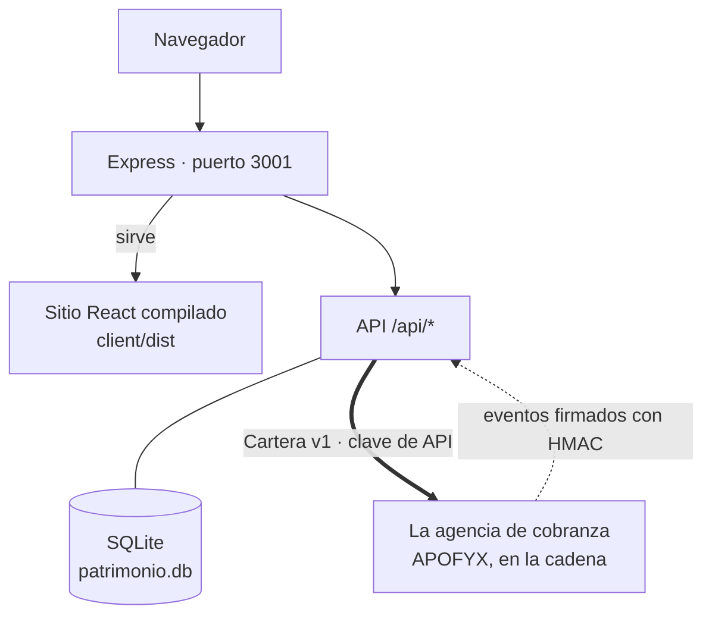
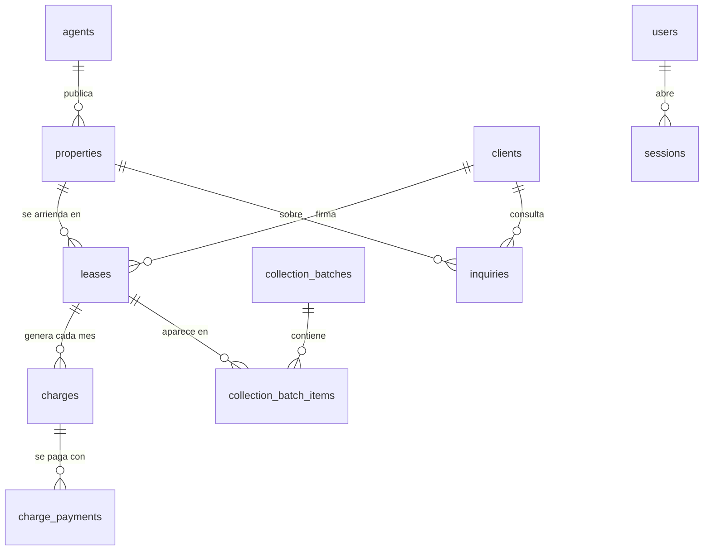

# Patrimonio Inmuebles

[](https://github.com/TechnicalBridge/patrimonioinmuebles/actions/workflows/ci.yml)

Sitio y panel de una corredora de propiedades chilena. Proyecto de Capstone; la empresa, las
personas y las propiedades son ficticias.

**Contexto:** Kobra fue el cliente directo original y se retiró. El equipo creó APOFYX como
cliente ficticio para continuar el Capstone. Patrimonio Inmuebles representa al acreedor
ficticio que entrega su cartera a APOFYX y recibe de vuelta los resultados de DataBridge.

La [evaluación local](#evaluación-local-del-29-de-septiembre-de-2026) registra las verificaciones
y límites de esta aplicación. La [evaluación general](../EVALUACION_GENERAL.md) explica el
conjunto cuando los tres proyectos están dentro de Capstone.

**Se levanta con una orden** y queda en http://localhost:3001 — solo hace falta Docker:

```powershell
docker compose up -d --build
```

| | |
| --- | --- |
| [1. Descripción](#1-descripción) | [2. Tecnologías](#2-tecnologías-utilizadas) · [3. Cómo ejecutarlo](#3-cómo-ejecutar-el-proyecto-localmente) · [4. Equipo](#4-integrantes-del-equipo) |
| [5. Metodología](#5-metodología-de-trabajo) | [6. Arquitectura](#6-arquitectura-de-la-solución) · [7. Modelo de datos](#7-modelo-de-datos) · [8. Docker](#8-docker) · [9. Pruebas](#9-pruebas) |

---

## 1. Descripción

### Qué hace

Patrimonio Inmuebles vende, arrienda y **administra arriendos**: cobra el arriendo mes a mes por
cuenta del propietario. El sitio publica las propiedades y recibe consultas; el panel interno
maneja clientes, asesores, inventario y —la parte que importa para este proyecto— la
administración de arriendos.

Esa administración es lo que convierte a la corredora en **acreedora**: cuando un arrendatario
deja de pagar, esa deuda es suya. Desde el panel se firman los contratos, se generan los cargos
del mes, se registran los pagos recibidos en la oficina y se emite la **cartera** a una fecha de
corte: todos los clientes con contrato, deban o no. Se la entrega a la agencia de cobranza que se
conecte desde el panel, y la agencia detecta a los morosos.

### A quién va dirigido

| Quién | Qué hace acá |
| --- | --- |
| **Quien busca propiedad** | Mira el catálogo y deja su consulta |
| **El personal de la corredora** | Entra al panel con su usuario: clientes, contratos, consultas, propiedades, arriendos y la conexión con la cobranza |
| **El arrendatario moroso** | No entra acá. Su deuda sale hacia la cobranza, y paga en otro sistema |

### Qué problema resuelve

Una corredora que administra arriendos tiene el mismo problema que cualquier acreedor chico: las
deudas son de monto bajo, son muchas, y perseguirlas una por una cuesta más de lo que recupera.
Además, si terceriza la cobranza, **se queda sin saber qué pasó**: le siguen cobrando a quien ya
pagó, y eso le cuesta el arrendatario.

Este sistema resuelve las dos puntas. Genera la cartera morosa en un formato acordado para que
una agencia la reciba sin que nadie transcriba nada, y **recibe de vuelta los avisos de pago**,
firmados, para que el contrato quede en $0 sin intervención humana. Como cada mes van todos los
clientes con contrato, el que se puso al día va **sin cargos**, y la agencia deja de cobrarle.

---

## 2. Tecnologías utilizadas

| Capa | Tecnología | Por qué |
| --- | --- | --- |
| **Lenguaje** | JavaScript (ES modules), Node 22 | |
| **Backend** | Express 4 | Una API pequeña: no necesita más |
| **Frontend** | React 18 · React Router 7 · Vite | |
| **Base de datos** | **SQLite**, con `sql.js` | Ver abajo |
| **Pruebas** | `node:test`, de la librería estándar | Sin dependencias de prueba que mantener |
| **Contenedores** | Docker · Docker Compose | |
| **Integración continua** | GitHub Actions | Pruebas y compilación del cliente en cada push |

**Por qué SQLite y no MySQL,** si los otros dos sistemas usan MySQL: porque esta empresa es
chica y su base cabe en un archivo. Un motor aparte agregaría un contenedor, un usuario, una
contraseña y un punto de falla, a cambio de nada que este sistema necesite. Es además la
demostración de que la integración funciona **entre motores distintos**: lo que une a los tres
sistemas es un contrato en HTTP, no una base compartida.

**Nube:** ninguna.

---

## 3. Cómo ejecutar el proyecto localmente

### La forma corta: todo en Docker

Lo único que hace falta es **Docker Desktop** corriendo.

```powershell
git clone https://github.com/TechnicalBridge/patrimonioinmuebles.git
cd patrimonioinmuebles
docker compose up -d --build
```

| | |
| --- | --- |
| Sitio | http://localhost:3001 |
| Panel | http://localhost:3001/admin · `admin@patrimonioinmuebles.cl`, clave `patrimonio` |

La base se crea sola la primera vez, con propiedades, clientes y contratos de demostración, y
vive en un volumen: sobrevive a `docker compose down` y a reconstruir la imagen. Los
[arriendos de demostración](#los-arriendos-de-demostración) se revisan en cada arranque: si falta
alguno, se agrega sin tocar lo que ya había. Para partir de cero, `docker compose down -v`.

### Para programar

Hace falta **Node 22 o superior**.

```powershell
npm install
npm run install:all
npm run dev
```

| | |
| --- | --- |
| Sitio | http://localhost:5173 |
| API | http://localhost:3001 |

Vite recarga al guardar y manda `/api` al servidor. La base queda en `server/patrimonio.db`.

> **Evolución del esquema.** La base lleva su versión en `PRAGMA user_version`, y
> `server/db.js` tiene la lista de migraciones. Al arrancar, una base anterior se pone al día sola
> y conserva sus datos. La versión 2 funde `tenants` en `clients`, pasa los contratos a
> `client_id` y agrega los usuarios, las sesiones y la conexión con la agencia. Reconstruye las
> tablas dentro de una transacción y revisa las llaves foráneas al final; si algo falla, no queda
> nada a medias. Aun así, **respalda la base antes** (`patrimonio.db`, o el volumen
> `patrimonio_datos`).

---

## 4. Integrantes del equipo

> **⚠ POR COMPLETAR ANTES DE ENTREGAR.** El equipo tiene que llenar la columna de rol.

| Integrante | Rol |
| --- | --- |
| Pedro Campos | |
| Martín Gutiérrez | |
| Flavio Henríquez | |
| Esteban Maino | |

---

## 5. Metodología de trabajo

**Kanban**, con prácticas de **DevOps** para la entrega. El seguimiento tarea por tarea de los
tres sistemas está en
[`TB_web/docs/plan-kanban.md`](https://github.com/TechnicalBridge/TB_web/blob/main/docs/plan-kanban.md).

En este repositorio eso se traduce en dos cosas concretas:

| Práctica | Qué resuelve |
| --- | --- |
| **Integración continua** | GitHub Actions corre las 41 pruebas y compila el cliente en cada push |
| **Pruebas sobre base temporal** | Corren con `PATRIMONIO_DB` apuntando a un archivo temporal, así que **nunca tocan los datos de desarrollo**. Una de ellas compara la cartera que genera el panel contra el ejemplo publicado del contrato: si alguno de los dos cambia, la prueba falla |

---

## 6. Arquitectura de la solución

Un solo proceso: Express sirve la API y, si encuentra el sitio compilado, también el sitio. El
cliente llama a `/api` con rutas relativas, así que no hay CORS que resolver ni un segundo
servidor que mantener.


```mermaid
flowchart TD
    N["Navegador"] --> E["Express · puerto 3001"]
    E -->|"sirve"| C["Sitio React compilado<br/>client/dist"]
    E --> A["API /api/*"]
    A --- B[("SQLite<br/>patrimonio.db")]

    A ==>|"Cartera v1 · clave de API"| AP["La agencia de cobranza<br/>APOFYX, en la cadena"]
    AP -.->|"eventos firmados con HMAC"| A
```

| Módulo | Qué hace |
| --- | --- |
| `server/index.js` | Las rutas: sitio público, panel, API de arriendos y el endpoint de eventos |
| `server/db.js` | La base: esquema, migraciones versionadas, siembra y el acceso |
| `server/usuarios.js` · `server/claves.js` | El login: claves con scrypt, sesiones en la base y el límite de intentos |
| `server/clientes.js` · `server/rut.js` | Los clientes, del interesado al arrendatario, y el RUT con su dígito verificador |
| `server/arriendos.js` | La lógica del negocio: contratos, cargos del mes, pagos, morosos al corte y lotes |
| `server/cartera.js` | Genera la cartera en el formato del contrato |
| `server/cobranza.js` | La conexión con la agencia: la comprueba, se suscribe a sus avisos y le envía la cartera |
| `client/` | El sitio y el panel en React |

### El panel

Se entra con **correo y clave** (`/admin`). Cada usuario tiene su clave, guardada con scrypt. La
sesión se guarda en la base (solo el hash del token), dura 8 horas y **Salir** la revoca en el
servidor. Tras cinco intentos fallidos, la IP espera diez minutos.

| Pestaña | Qué hace |
| --- | --- |
| **Clientes** | Un solo registro por persona o empresa: el que preguntó por una propiedad es *interesado*, y al firmar pasa a *arrendatario*. Desde su ficha se firma un contrato |
| **Arriendos** | Los morosos a la fecha que elijas, los cargos del mes, los pagos en la oficina y las carteras entregadas |
| **Cobranza** | La conexión con la agencia |

**Un contrato nuevo puede empezar en el pasado:** al firmarlo se emiten los arriendos desde el
mes de inicio hasta hoy. Un contrato que empezó hace tres meses sin pagos es un moroso real. Para
firmar, el cliente necesita RUT y un correo o teléfono, y la base lo exige con un trigger.

### La cartera

`server/cartera.js` la arma en el formato **Cartera v1** del
[contrato de integración](https://github.com/TechnicalBridge/TB_web/tree/main/docs/integracion).
Van **todos los clientes con contrato, deban o no**. El que está al día va con `cargos: []`, y un
contrato terminado sigue yendo mientras deba. Así la agencia detecta al moroso, y deja de cobrarle
al que pagó directo en la oficina.

En la pestaña **Arriendos**:

- **Generar los cargos del mes.** Correrlo dos veces no cobra dos veces.
- **Registrar un pago** recibido en la oficina, total o parcial.
- **Emitir la cartera** a una fecha de corte. Queda en borrador y se puede descargar como
  archivo; recién al enviarla cuenta como entregada.
- **Enviarla a la agencia** con el botón *Enviar a {la agencia conectada}*. El lote guarda la
  respuesta contrato por contrato: cuántas aceptó y, de las que no, el motivo (por ejemplo, que
  pasó los 120 días de mora y se la devuelve). Si la agencia no contesta, el lote sigue en
  borrador y se puede volver a enviar tal cual. Sin agencia conectada, el botón es *Marcar
  enviada* y el archivo se entrega a mano.

### La conexión con la agencia

Patrimonio no tiene escrito el nombre de ninguna agencia. En la pestaña **Cobranza** se pega la
dirección de la agencia y la clave que ella emitió para Patrimonio (en APOFYX, desde su portal de
empresas, en *Conectar mi sistema*). Al tocar **Conectar**:

1. `GET {agencia}/api/v1/cuenta` comprueba que la clave sirve y que es de Patrimonio.
2. `POST {agencia}/api/v1/suscripciones` le dice a la agencia dónde avisar los pagos.
3. Se guarda todo en `agency_connection`, con el secreto de esos avisos.

El panel muestra *Conectado con APOFYX*: el nombre lo dijo la agencia. Sirve igual cualquier
agencia que hable el contrato, o la plataforma de pagos directo.

### Los arriendos de demostración

Diez contratos, cada uno en una situación distinta. Son los mismos arrendatarios que traen los
datos de ejemplo de APOFYX y de DataBridge, así que los tres sistemas cuentan la misma historia.

| Contrato | Arrendatario | Situación |
| --- | --- | --- |
| CTR-2025-014 | Felipe Rojas Muñoz | Debe agosto y septiembre |
| CTR-2026-031 | Valentina Soto Pizarro | Debe septiembre |
| CTR-2024-007 | Comercial Ñandú SpA | Debe julio a septiembre, en UF |
| CTR-2025-022 | Tomás Fuentes Leiva | Se puso al día en la oficina: en la cartera va sin cargos |
| CTR-2026-008 | Josefa Alcaíno Ruiz | Al día |
| CTR-2025-019 | Rodrigo Pérez Contreras | Debe junio a septiembre |
| CTR-2026-012 | Carolina Muñoz Vera | Debe agosto y septiembre |
| CTR-2024-019 | Panadería La Espiga Ltda. | Debe julio a septiembre, en UF |
| CTR-2025-027 | Ignacio Tapia Rojas | Entregó el departamento el 31 de agosto debiendo junio a agosto. Su contrato terminó, pero sigue en la cartera mientras deba |
| CTR-2026-015 | Daniela Cáceres Flores | Debe julio a septiembre |

La cartera de agosto (`PAT-2026-08-18-01`) figura como entregada, con ocho deudas.

### Recibir los pagos desde la cobranza

`POST /api/eventos` recibe los avisos de pago y marca los cargos. Pide firma HMAC con el secreto
que la agencia entregó al conectarse en **Cobranza**, y lo lee de la base en cada aviso. **Está
apagado mientras no haya agencia conectada.**

Con eso, un pago hecho en el portal de DataBridge termina como abono en el contrato, repartido del
cargo más antiguo al más nuevo, con medio `cobranza`. Sin agencia, Patrimonio funciona igual y los
pagos se registran a mano.

---

## 7. Modelo de datos


```mermaid
erDiagram
    properties ||--o{ leases          : "se arrienda en"
    clients    ||--o{ leases          : "firma"
    leases     ||--o{ charges         : "genera cada mes"
    charges    ||--o{ charge_payments : "se paga con"
    collection_batches ||--o{ collection_batch_items : "contiene"
    leases     ||--o{ collection_batch_items : "aparece en"
    clients    ||--o{ inquiries       : "consulta"
    properties ||--o{ inquiries       : "sobre"
    agents     ||--o{ properties      : "publica"
    users      ||--o{ sessions        : "abre"
```

| Tabla | Qué guarda |
| --- | --- |
| `properties` | Título, tipo, operación, precio y moneda, dormitorios, baños, m², dirección, comuna, región y fotos |
| `clients` | El cliente, persona o empresa, con su **RUT** normalizado (único si está). El interesado y el arrendatario son el mismo registro en otra etapa. Un trigger impide firmar sin RUT o sin correo ni teléfono, y quitarle el RUT a quien ya firmó |
| `inquiries` · `agents` | Por qué propiedad preguntó el cliente, y qué asesor la atiende |
| `leases` | El contrato, de un cliente. Su `codigo` (`CTR-2025-014`) es el identificador que viaja a la cobranza y permite que un pago vuelva hasta acá |
| `charges` | Un cargo por mes. El `UNIQUE` impide cobrar dos veces el mismo período |
| `charge_payments` | Los pagos, sumados aparte. **El saldo se calcula, no se guarda**, para que no haya dos números que puedan discrepar |
| `collection_batches` | Qué cartera se entregó a cobranza, cuándo, y qué respondió la agencia: `enviado`, `aceptado` o `parcial` |
| `inbound_events` | Los avisos recibidos, para no procesar dos veces el mismo |
| `users` · `sessions` | Los usuarios del panel, con su clave en scrypt, y sus sesiones: el hash del token, cuándo vence y si se cerró |
| `agency_connection` | Una sola fila: la agencia conectada, su clave y el secreto de sus avisos |

Dos vistas hacen las cuentas: `v_charge_balance` (saldo de cada cargo) y `v_lease_debt` (deuda
por contrato). Las propiedades en administración quedan con estatus `arrendada`, así que no se
publican en el sitio.

La venta se publica en **UF** y el arriendo residencial en **pesos**; el arriendo comercial se
pacta en UF. Por eso cada propiedad guarda su moneda.

> **Ojo con las llaves foráneas.** `db.export()` de sql.js cierra y reabre la base, lo que apaga
> el PRAGMA `foreign_keys`. Como acá se persiste después de cada escritura, hay que volver a
> encenderlo pegado al `export`; si no, las llaves foráneas quedan decorativas desde el primer
> INSERT.

---

## 8. Docker

### Qué se construye

Una sola imagen, [`Dockerfile`](Dockerfile), en **dos etapas**: la primera compila el sitio con
Node, la segunda instala solo las dependencias de producción del servidor y copia el sitio
compilado al lado. La imagen final no lleva las herramientas de compilación.

El contenedor **no corre como root** (usuario `node`, el que trae la imagen oficial) y declara un
`healthcheck` contra `/api/health`.

La base vive en un **volumen** (`/datos/patrimonio.db`), no dentro de la imagen: si estuviera
dentro, cada reconstrucción borraría los datos.

### Variables de entorno

Documentadas en [`.env.example`](.env.example). Todas tienen valor por omisión.

| Variable | Por omisión | Para qué |
| --- | --- | --- |
| `PORT` | `3001` | Puerto del sitio y de la API |
| `ADMIN_CORREO`, `ADMIN_PASSWORD` | `admin@patrimonioinmuebles.cl` / `patrimonio` | El primer usuario del panel. Se crea solo si la base no tiene ninguno. **Cambiar** |
| `PATRIMONIO_DB` | `/datos/patrimonio.db` en el contenedor | Dónde vive la base |

La agencia de cobranza no va en variables: se conecta en la pestaña **Cobranza** y queda en la
base.

---

## 9. Pruebas

```powershell
npm test
```

**41 pruebas** con `node:test`, sobre una base temporal, así que no tocan `server/patrimonio.db`.

| Qué cubre |
| --- |
| El login: la clave correcta, la sesión que vence y la que se cierra, y el bloqueo tras cinco intentos |
| Que una base de la versión 1 migre a la 2 **conservando sus datos**, y que migrar dos veces no cambie nada |
| Los clientes y sus contratos: el RUT válido, el contrato que empieza en el pasado con sus cargos, y lo que la base no permite |
| Que la cartera lleve a todos los clientes con contrato, con `cargos: []` para los que están al día |
| Conectar la agencia: la clave de otra empresa se rechaza, y el secreto de sus avisos queda en la base |
| El cálculo de morosos a una fecha de corte, con sus días de mora |
| Que emitir los cargos del mes dos veces no cobre dos veces |
| Que un pago en la oficina deje el **saldo** en la cartera, no el monto original, y que el mismo pago no abone dos veces |
| Que el lote se emita, se descargue y se marque enviado una sola vez |
| Que el botón le entregue el lote a la agencia y guarde su respuesta contrato por contrato, y que si la agencia falla el lote siga en borrador |
| Los eventos de pago: firma, antirrepetición y deduplicación |
| Que la cartera generada sea **exactamente** el ejemplo publicado del contrato de integración, y que la copia local siga al día con la de `TB_web` si ese repositorio está al lado |
| Que dos propiedades con el mismo título no revienten: la segunda recibe otro slug |
| Que **ningún error salga con la traza del servidor** |
| Que las llaves foráneas sigan encendidas después de persistir, y que la base rechace lo que el negocio no permite |

---

Este repositorio es una de tres piezas: **Patrimonio Inmuebles** →
[**APOFYX**](https://github.com/TechnicalBridge/APOFYX) →
[**DataBridge**](https://github.com/TechnicalBridge/TB_web).

## Evaluación local del 29 de septiembre de 2026

### Estado y evidencia

La aplicación cubre el origen de la deuda dentro del caso ficticio: contratos, cargos del mes,
pagos recibidos y emisión de cartera. También materializa el retorno del pago desde la agencia.
El sitio inmobiliario da contexto al acreedor, mientras que el módulo de arriendos conecta
directamente con el objetivo de integración del Capstone.

| Comprobación | Resultado |
| --- | --- |
| `npm test` desde la raíz del proyecto | **41 pruebas aprobadas**, sin fallos ni omisiones |
| `npm run build` en `client/` | Compilación correcta |
| Recorrido en navegador (Edge) | Login, cliente nuevo, contrato con fecha pasada, conexión con la agencia, envío de la cartera y el pago que vuelve hasta el contrato |
| Node utilizado en la revisión | 24.14.1; la CI declara Node 22 |
| Persistencia de pruebas | Archivos SQLite temporales; no se usó la base del usuario para los casos de prueba |
| Contrato compartido | Pasó la comparación del ejemplo local con el de TB_web |
| Docker Compose | Configuración válida; un servicio `sitio` |
| Aplicación existente | `/api/health` respondió HTTP 200 en el puerto 3001 |

El contenedor existente no se reconstruyó. El recorrido en navegador se hizo sobre la copia de
prueba de la cadena (`cadena.mjs`), no sobre la base del usuario; no hay una suite automática del
frontend.

### Fortalezas comprobables

- `server/arriendos.js` separa generación de cargos, abonos, morosidad, lotes y aplicación de
  eventos. El mismo período o pago no debe generar cargos o abonos duplicados.
- `server/cartera.js` convierte los datos del negocio al contrato de integración, sin requerir
  acceso a una base MySQL ni a las tablas de otra empresa.
- El lote guarda la respuesta de la agencia por contrato. Ante un fallo del envío conserva el
  borrador y permite reintentar el mismo contenido.
- La API conserva el cuerpo original para verificar HMAC. Sin agencia conectada, el receptor de
  eventos queda deshabilitado.
- Las pruebas ejercitan el servidor con una agencia HTTP simulada y archivos temporales.
  Comprueban también que las llaves foráneas sigan activas después de exportar la base.

### Límites actuales

| Área | Evidencia en el código | Implicación |
| --- | --- | --- |
| Usuarios del panel | Usuarios con clave y sesiones en la base, con vencimiento; sin roles ni pantalla para crear usuarios | Todos los usuarios pueden todo; el primero sale de `ADMIN_CORREO` |
| Límite de intentos | Se lleva en memoria, por IP | Reiniciar lo borra; varias instancias no lo comparten |
| Orígenes | `app.use(cors())` | Restringir CORS antes de exponer el servicio |
| Escritura de datos | sql.js mantiene la base en memoria y `persist` la exporta a archivo | Mantener una instancia escritora; varios procesos sobre el mismo archivo necesitan otra estrategia |
| Validación de interfaz | Existe build, pero `client/package.json` no declara una suite de pruebas | Compilar no comprueba accesibilidad ni todos los recorridos del panel |

Estos límites no impiden demostrar el escenario actual. Sí delimitan el tipo de despliegue
que puede defenderse con la evidencia disponible.

### Pendientes y operación

1. Mantener la ejecución de una sola instancia escritora y documentar respaldo/restauración
   del archivo indicado por `PATRIMONIO_DB` o del volumen `patrimonio_datos`.
2. Cada cambio de esquema, como una migración nueva en `server/db.js`, con su prueba desde la
   versión anterior.
3. Si se amplía el acceso al panel, agregar roles y una pantalla de usuarios; cambiar la
   contraseña de demostración.
4. Completar los roles del equipo y mantener el catálogo de datos explícitamente ficticio.

Para diagnosticar un envío, revisar la pestaña **Cobranza** (dirección y clave) y después el
resultado por contrato del lote. Para un aviso de pago, revisar que la dirección de avisos sea
alcanzable desde la agencia, la firma y el identificador deduplicado. Recibir HTTP 200 de la
agencia no significa que todas las deudas hayan sido aceptadas por DataBridge.

En la demo conjunta el sitio usa **5174**; al ejecutar este proyecto solo con `npm run dev`,
Vite usa **5173**. Con Docker, Express sirve el sitio compilado y la API en **3001**.

La bitácora `Technical-Bridge/` queda fuera de esta evaluación.
